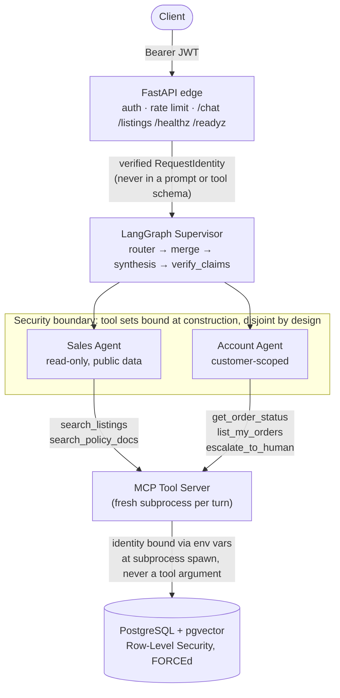

# dealership-agent

An agentic AI customer-service assistant for a used-car dealership: a
LangGraph supervisor routes each customer message to one or two
permission-scoped sub-agents, which call tools through an MCP server
backed by Postgres/pgvector, behind a JWT-authenticated FastAPI edge. It
exists as a portfolio piece demonstrating a security-first, eval-driven
approach to building agentic systems: the core design question this
project answers is not "can the agent find a car?" but "can the LLM ever
be tricked into reading someone else's data?" The answer is structurally
no, not just prompted-to-refuse.

See [CLAUDE.md](CLAUDE.md) for the full set of locked architecture
decisions and engineering standards this project is built to, and
[docs/ARCHITECTURE.md](docs/ARCHITECTURE.md) for the longer technical
write-up with links to every ADR.

## How to evaluate this project (5 minutes)

If you only have a few minutes, these three things carry the most
signal:

1. **The RLS red-test** ([Security Model](#security-model) below): a
   live, three-row before/after/after-again table showing that disabling
   Row-Level Security turns "customer A's query returns nothing" into
   "customer A's query returns customer B's order" - the failure this
   architecture exists to make structurally impossible, demonstrated
   directly rather than just asserted.
2. **The action-claim eval, including the reverted change**
   ([Evaluation](#evaluation) below): three real experiments measured
   against a labelled 71-case eval set, one of which (span-validation)
   looked plausible and measured worse, so it was reverted rather than
   shipped. The revert is documented in
   [ADR 0008](docs/adr/0008-span-validation-revert.md), not hidden.
3. **The live deployment verification** ([Deployed to AWS](#deployed-to-aws)
   below): the security boundary re-confirmed against real AWS
   infrastructure, with CloudWatch evidence that Row-Level Security, not
   an application-level filter, is what rejected a cross-customer query.

## Architecture



One FastAPI service (no microservices, per CLAUDE.md). A request's
identity is authenticated once, at the edge, from a verified JWT, never
from the request body. The Supervisor fans out to whichever sub-agent(s)
a message needs (a single message can touch both, e.g. "find me a cheap
SUV and tell me if my order shipped"), each sub-agent only ever sees its
own narrow tool set, and every tool call passes through one MCP
subprocess per conversation turn, which is the only place identity is
ever bound to a database query.

## Security Model

**The core invariant: the LLM must never be able to choose whose data it
reads.** Everything below exists to make that structurally true, not
merely instructed.

- **Identity-free tool schemas.** `get_order_status(order_ref)`,
  `list_my_orders(status_filter?)`, `escalate_to_human(summary, reason)`:
  no tool the model can see ever has a `customer_id`, `tenant_id`, or
  any identity parameter in its schema. There is no field for a
  compromised or confused model to fill in with someone else's ID, because
  that field does not exist.
- **The chokepoint.** Every tool call is executed inside
  `tools/scope.py::customer_scoped_connection()`, the one and only place
  a database connection is opened for a tool. There is no second code
  path that reaches Postgres.
- **MCP session identity, not a tool argument.** One conversation turn
  spawns one MCP tool-server subprocess; the verified customer's identity
  is bound to that subprocess once, via environment variables at spawn
  time (`agents/mcp_session.py`), and read into a contextvar for the
  process's whole lifetime. It is never passed as part of a `tools/call`
  request. See [ADR 0004](docs/adr/0004-mcp-identity-propagation.md) for
  why a per-call channel was rejected even though MCP supports one.
- **Postgres Row-Level Security, defense in depth.** Every customer-scoped
  table has RLS enabled *and* `FORCE`d (so it applies even to the table
  owner), with policies comparing each row's `customer_id` against
  `current_setting('app.customer_id', true)`, which returns `NULL`, not
  an error, when unset, and `column = NULL` is never true in SQL. An
  absent scope yields **zero rows**, never every row: the failure mode is
  closed, not open.

**Red-test evidence that this isn't decorative** (`tests/security/test_rls.py`
proves the protected state; the disabled-state comparison below was run
once, live, against a disposable database, specifically for this README):

| State | Unscoped `SELECT * FROM orders` (app role, no scope set) |
|---|---|
| RLS enabled + `FORCE`d (normal) | **0 rows** |
| RLS explicitly disabled | **every row** (both test customers' orders) |
| RLS re-enabled | **0 rows** again |

Disabling the exact safeguard this project relies on turns "customer A's
query returns nothing" into "customer A's query returns customer B's
order," precisely the failure this architecture is designed to make
structurally impossible, not just unlikely.

The same invariant is checked directly in
[`tests/security/`](tests/security/): tool schemas contain no identity
fields, a customer cannot read another customer's order, an unscoped
session fails closed, and (`test_agent_identity_isolation.py`) the
customer's numeric ID never appears in any prompt or message sent to the
LLM, under any routing path.

## Evaluation

Agent-behavior changes in this project are measured against a labelled
eval set, not tuned by intuition (`evals/datasets/action_claims.jsonl`,
71 hand-labelled cases; `evals/run_action_claim_eval.py`, precision/
recall/F1/confusion matrix against a real Groq call). The concrete
problem: does a synthesized reply falsely claim a customer-facing action
happened (a cancellation, a booking, a handoff to a human) that no real
tool result actually backs?

| Verifier design | VIOLATION P / R / F1 | CLEAN P / R / F1 | Accuracy |
|---|---|---|---|
| Single-stage (one call judges "is there a claim" and "is it true" together) | 0.500 / 0.955 / 0.656 | 0.966 / 0.571 / 0.718 | **0.690** |
| Two-stage (split detection from substantiation) | 0.826 / 0.864 / 0.844 | 0.938 / 0.918 / 0.928 | **0.901** |
| Two-stage + span-validation (an attempted refinement) | 0.933 / 0.636 / 0.757 | 0.857 / 0.980 / 0.914 | 0.873 |

The third row is the point of having an eval set. It looked like a
plausible improvement, validating the specific span a verifier flags as a
claim and discarding findings that don't hold up in isolation, and it
measured *worse*: CLEAN precision dropped from 0.938 to 0.857, because
the isolated-span re-check started waving through genuine violations like
"Your request has been escalated to our team" (passive voice loses the
claim when re-checked out of context). Per this project's own rule, if
a change measures worse, revert it and say so: it was reverted, and the
two-stage design (row two) is what's actually shipped. See
[ADR 0008](docs/adr/0008-span-validation-revert.md) for the full record
of this experiment. A number that doesn't move the way you hoped is the
eval set doing its job, not a failure to hide.

## Known Limitations

Stated plainly, not hidden:

- **Residual stage-2 misattribution.** The verifier's substantiation
  check occasionally accepts an unsubstantiated claim as backed by an
  unrelated real tool result, or (rarely) misattributes which sentence in
  a reply is the actual claim when a real escalation coexists with
  unrelated informational text. Not eliminated by the two-stage design,
  only reduced.
- **VIOLATION recall was traded for CLEAN precision.** Moving from 0.955
  to 0.864 recall on true violations means roughly one in seven genuine
  false claims is missed, in exchange for cutting false positives on
  benign replies by more than 3x. This tradeoff was deliberate and
  measured, not accidental, but it is a real cost, not a free win.
- **Groq's free tier rate-limits aggressively** (6,000 tokens/minute at
  time of writing). The loop token budget guard
  (`Settings.loop_token_budget`) and explicit logged backoff
  (`llm/groq_provider.py`) exist specifically to degrade honestly under
  this ceiling rather than crash or hang, but it remains a real
  throughput constraint for local dev.
- **No native tool-calling protocol.** Both providers speak a
  structured-JSON-in-plain-text convention
  (`{"action": "call_tool", ...}`) rather than the Converse API's or
  Groq's native function-calling, a deliberate choice so both providers
  share one interface (see
  [ADR 0007](docs/adr/0007-bedrock-provider-and-model-routing.md)), at
  the cost of needing response normalization
  (`llm/base.py::normalize_llm_response`) to paper over how differently
  each provider's model formats that JSON in practice.

## Data Honesty

This project is transparent about where its data comes from:

- **Car listings** are real market data sourced from a public dataset.
- **The transactional layer** (orders, customers, bookings) is
  **synthetic**, generated by a seeded, reproducible script under
  `data/scripts/`. No real customer or transaction data is used anywhere
  in this project.
- **Policy documents** (warranty, returns, financing policy, etc.) are
  hand-authored for this project, not sourced from any real dealership.

This distinction is never obscured in code, documentation, or output.

## CI

[`.github/workflows/ci.yml`](.github/workflows/ci.yml) runs five jobs on
every push/PR: `lint`, `typecheck`, `test` (unit + integration against a
real Postgres+pgvector service container), `security` (a **separate**
required job, so a security-test failure shows up as its own distinct
red X, never buried in a general test log), and `build` (Docker image
build, no push). A sixth job, `eval`, runs the action-claim eval on a
weekly schedule or manual dispatch only, never per-commit, since it
makes real, non-deterministic LLM calls.

**Maintainer setup required before the scheduled `eval` job will run**:
add a `GROQ_API_KEY` repository secret (Settings → Secrets and variables
→ Actions → New repository secret) with a real key from
[console.groq.com](https://console.groq.com). Optionally also add
`LLM_MODEL_CLASSIFIER`/`LLM_MODEL_SYNTHESIS` repository *variables* if you
want the eval to run against different models than your local `.env`.
The `lint`/`typecheck`/`test`/`security`/`build` jobs need no secrets at
all: they never make a live LLM call (see `tests/conftest.py`'s
`FakeLLMProvider`).

## Local Setup

From a clean clone, on a machine with [uv](https://docs.astral.sh/uv/),
Docker, and Python 3.12:

```bash
git clone <this-repo> && cd dealership-agent

# 1. Install dependencies (creates .venv from uv.lock)
uv sync

# 2. Configure environment
cp .env.example .env
# Edit .env: at minimum set POSTGRES_*/APP_DB_*/DATABASE_*, a real
# GROQ_API_KEY (free, from console.groq.com), and JWT_PUBLIC_KEY_PATH /
# JWT_PRIVATE_KEY_PATH (e.g. dev_keys/dev_jwt_public.pem /
# dev_keys/dev_jwt_private.pem: the next script below generates these
# files if they don't exist yet).

# 3. Start Postgres (+ pgvector) and a self-hosted Langfuse instance
docker compose up -d

# 4. Apply migrations (creates the least-privilege app role, enables RLS)
uv run alembic upgrade head

# 5. Load data
#    Policies (committed to the repo, no external credentials needed):
uv run python data/scripts/embed_policies.py
#    Vehicles: the real pipeline needs a Kaggle account
#    (download_listings.py -> clean_listings.py -> load_listings.py ->
#    embed_listings.py). To try things out immediately without Kaggle
#    credentials, seed a small synthetic catalog instead:
uv run python scripts/seed_ci_vehicles.py

# 6. Generate a dev JWT keypair and mint a token for a test customer
#    (refuses to run if APP_ENV=production)
uv run python scripts/mint_dev_token.py --customer-id 1

# 7. Run the API
uv run uvicorn dealership_agent.api.app:app --reload
```

In a second terminal, with the token from step 6:

```bash
curl http://127.0.0.1:8000/healthz
curl "http://127.0.0.1:8000/listings?query=reliable+family+SUV&limit=3"
curl -X POST http://127.0.0.1:8000/chat \
  -H "Content-Type: application/json" \
  -H "Authorization: Bearer <token-from-step-6>" \
  -d '{"message": "What SUVs do you have under 30000?"}'
```

Or skip the HTTP layer entirely and watch a scripted 6-conversation
walkthrough (catalog search, policy Q&A, an authenticated order lookup,
the security boundary in action, the action-claim verifier catching an
unbacked promise, and honest degradation):

```bash
uv run python scripts/demo.py
```

## Testing

```bash
uv run pytest                                   # everything except live-credential tests
uv run pytest -m requires_live_credentials      # needs real Groq + AWS credentials
uv run python evals/run_action_claim_eval.py    # needs a real GROQ_API_KEY
```

`make lint` / `make typecheck` / `make test` wrap the same commands (see
[`Makefile`](Makefile)).

## Deployment

AWS ECS Fargate via Terraform (`infra/terraform/`), fronted by an ALB,
with RDS Postgres+pgvector in a private subnet and no NAT Gateway
(deliberately, see [Why these choices](docs/ARCHITECTURE.md#why-these-choices-not-the-alternatives)).
GitHub Actions deploys via OIDC (`.github/workflows/deploy.yml`, manual
dispatch only), no long-lived AWS keys anywhere, no Kubernetes, per
[CLAUDE.md](CLAUDE.md)'s locked architecture decisions.

See [`docs/DEPLOYMENT.md`](docs/DEPLOYMENT.md) for the full runbook
(bootstrap, apply, verify, enabling the deploy workflow, and teardown)
and [`infra/terraform/COST.md`](infra/terraform/COST.md) for the
per-resource cost breakdown: read that one first, since this
deployment costs real money the moment it's applied (roughly $58-70/month
if left running).

### Deployed to AWS

This project has been deployed and verified against real AWS
infrastructure, not just planned on paper: 42 resources in `eu-west-1`
(ECS Fargate running the app, RDS Postgres+pgvector in a private subnet,
an ALB, ECR, IAM roles, SSM parameters, VPC/subnets/security groups) via
`terraform apply`, seeded with real vehicle listings and policy
embeddings, then torn down again (`terraform destroy`) once verification
was complete. See the teardown section of `docs/DEPLOYMENT.md`.

**The security boundary held under live conditions.** With two seeded
customers, customer A's authenticated `/chat` request for customer B's
order came back "not found" instead of leaking it. This was confirmed at
two independent layers, not just the chat response text: CloudWatch logs
for the tool call itself show the database query returned `row_count: 0`
for the cross-customer request versus `row_count: 1` for the same
customer asking about their own order, proof the Row-Level Security
policy is what's rejecting the query, not an application-level filter
that happened to return the right answer.

**Two real bugs only surfaced under live deployment, not local testing:**

- `/readyz` made a synchronous, blocking database call inside an async
  FastAPI handler. Locally, single sequential requests never exposed
  this. Behind a real ALB, health checks arrive from multiple
  availability zones near-simultaneously, and the blocking call stalled
  the single-worker event loop long enough that the service could never
  pass its own health check, regardless of how much CPU or timeout
  budget it was given. Fixed by running the check via
  `asyncio.to_thread`.
- The Bedrock IAM policy scoped the foundation-model resource ARN to a
  single region. Cross-region ("`eu.`"-prefixed) inference profiles
  don't guarantee the underlying request lands in that region: a live
  call actually routed to `eu-north-1` instead of the configured
  `eu-west-1`, and AWS checks the foundation-model resource against
  whichever region the request lands in, not the caller's own region.
  IAM policies for cross-region inference profiles are a real deployment
  concern that a local Bedrock call (or a unit test) with a single fixed
  region would never exercise.

Both are the kind of concurrency and region-routing bugs that only show
up under actual multi-AZ, load-balanced, cross-region conditions, the
reason "verify against a real deployment" is its own step, not assumed
from a clean `terraform apply` and a passing test suite.

Cost while live: roughly $58-70/month if left running (see
`infra/terraform/COST.md`); this deployment was torn down immediately
after verification, so actual spend was a small fraction of that.
